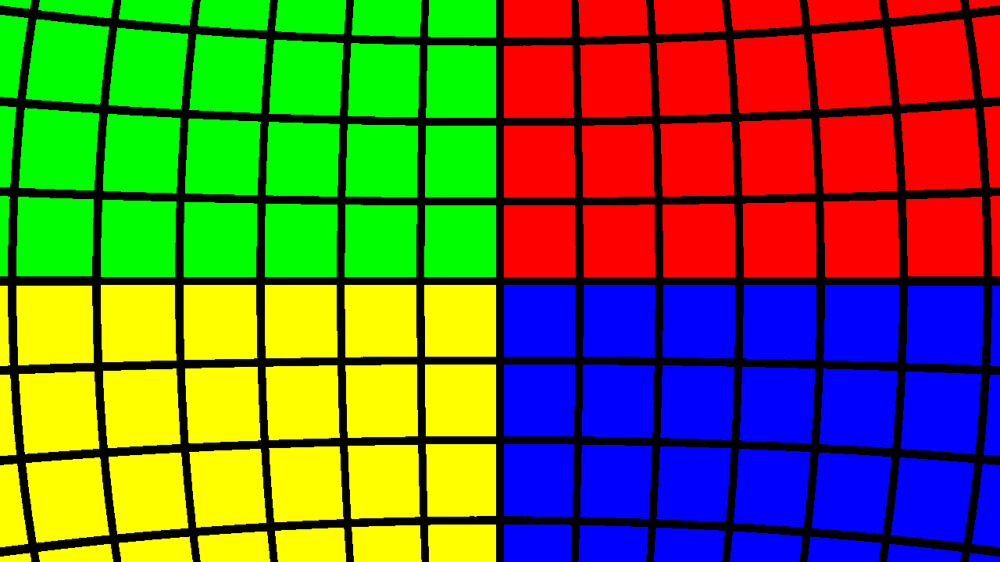
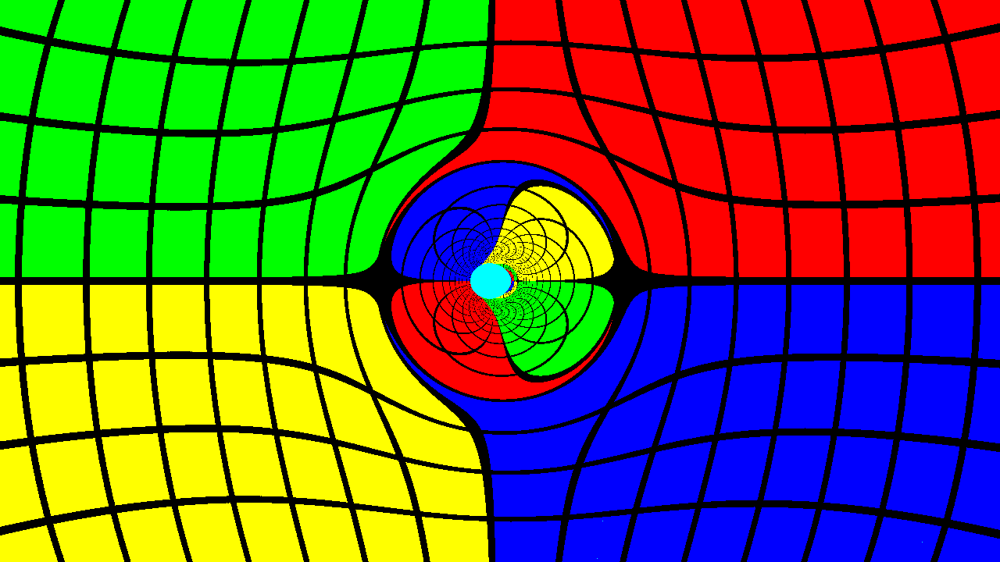

Introducing **Tetra Gray**, a CUDA-accelerated general-relativistic raytracer.  Tetra Gray has performed raytracing in spinning black hole spacetimes using a single coordinate system, both inside and outside the black hole horizon.

Raytracing in general relativity sheds light on several interesting optical effects: curved spacetime bends light, requiring step-by-step integration of trajectories to compute the paths of light rays.

It does something like this. Here's a flat space image with a false-color sphere:

And here's that same system with a spinning black hole in front of the camera:

# How does Tetra Gray work?

Tetra Gray uses several semi-independent components to build up the raytracing simulation and image.  Broadly, the pipeline is broken down into distinct stages:

- Image initial data: computing the directions of each photon corresponding to a single pixel, based on the field of view, camera position and orientation, and image dimensions.
- Casting photons into the scene: the photons are evolved backward in time using numerical integration. The particular spacetime being used dictates the time derivatives of the photon's position and momentum.
- Stopping evolution: numerical integration is terminated when the photon meets some termination condition. This could be a distance threshold from the central black hole or some analysis of the photon's redshift to determine that it is trapped within the black hole.
- Converting photons to pixel colors: photon position and/or momentum dictates the color of the pixel it's associated with. This could be based on a real background image (a survey of the galaxy) or some artificial "painted" surface surrounding the system.
- Writing the image to disk: Tetra Gray uses png++.

Tetra Gray is designed to be modular: using higher-order functions, different termination conditions, integrators, spacetimes, or colormaps can be used without affecting the general structure of the computation.

Finally, Tetra Gray uses thrust to parallelize the computation over an Nvidia GPU.

# Building and Running the Code

Right now, Tetra Gray must be built from source.  A sample `scons` SConstruct file is provided, which can build three executables:

- `test` is a simple battery of tests to check for correctness and consistency with preexisting behavior, primarily for development purposes.
- `flat` uses the `FlatRHS` functor, and is convenient as a test of the raytracer and colormap.
- `doran` is the spinning black hole raytracer.

`flat` and `doran` require `png++`, and the whole code uses Thrust for parallelization.  These executables have been built and run personally on Ubuntu 15.10 using CUDA 7.5 (required for device lambda and `-std=c++11` support), using an i7-3770 and a GTX 660.

Currently, `doran` and `flat` have not been run using double precision, largely in respect for the 63 register limitation of the GTX 660 and other compute capability 3.0 cards.  Tensor manipulations are very intensive and could cause great reduction in performance.

Raytracing runtimes will vary. In general, the more rays that end up in a horizon, the longer runtimes will be, as we currently do not use an analytic equation for a horizon to do remove rays--this enables raytracing from inside a horizon, for instance--and rays will generally be evolved until they reach the maximum evolution parameter (iterations).  With the above specifications, raytracing using `doran` at 20 units from the black hole should take under 30 seconds for 720p images, at reasonable step sizes

# Description of Primary Components

The following is a general description of each general stage of the raytracing simulation.

## Image Initial Data

Included in `image_id.cuh` is a simple image initial data functor, taking a camera position and orientation, image dimensions, horizontal field of view, and a numbered index for the pixel to generate a photon with position and momentum, suitable to be evolved.

From the central view direction of the camera, photons' momenta are rotated along the vertical and horizontal directions of the camera. Hence, each pixel's photon is rotated by a fixed angle from its horizontal and vertical neighbors.

## Photon Evolution

Unlike raytracing in Newtonian physics, general relativistic raytracing requires numerical integration. Photons can follow curved paths that cannot be computed in advance.

`integrator.cuh` has a model for a simple, generic ODE integrator with a simple 4th order Runge-Kutta stepper (that can, in principle, be swapped out for any other stepper).

A photon is characterized by position (that is, four coordinates--time, and x, y, z Cartesian coordinates for instance) and momentum.  And more or less as in Newtonian mechanics, the derivative of position is momentum, and the derivative of momentum is acceleration.  Both can be influenced, however, by the effects of spacetime, and these are prescribed by the generic type `RHS` in the integrator.

An additional wrinkle is that we characterize photon trajectories by an arbitrary parameter (the `param` member of the `ODEData` template).  This decouples the photon's evolution in coordinate time from the trajectory parameter, simplifying some equations.  So photons are evolved in terms of this parameter, which generally corresponds to going backward in coordinate time (but is not required to do so--you might actually see an image from the "future"!).

In the spinning black hole spacetime, we use an adaptive stepsize algorithm to supplement the integrator.  This adjusts the steps in evolution parameter by looking at the maximum distance (or coordinate time) the photon could travel in a step and normalizing this across all photons. This ensures that all photons are evolved by an appropriate step.

## Termination Conditions

The evolution of a single photon can be stopped by any arbitrary condition provided.  Typical ones are included in `image.cuh` and `stepsize.cuh`. Various reasons to stop the evolution include escape beyond a fixed radius, a total amount of the evolution parameter (corresponding, naively, to some maximum number of steps), or--in the case of adaptive steps--a maximum ratio between the baseline step and the current step.  The latter is particularly useful for detecting when photons fall irretrievably beyond a black hole horizon.

## Photon Array to Image

Each photon is converted into an RGB color.  `image.cuh` has the `SphericalColormap` functor that we use for this (though again, this can be replaced by any other functor with appropriate signature). This paints a sphere with four regions of color and latitude/longitude gridlines, making for easy visualization of the stretching of spacetime in all regions.

The image is then written to disk using `png++`.

# Utilities, Tools, and Mathematical Models

Tetra Gray utilizes semi-independent tools to help glue together the raytracer:

- a "functional toolkit" provides a powerful interface for composing functors, both in host and device code
- Clifford algebra provides the mathematical backbone of the tensor manipulations required for general relativistic spacetimes
- The spinning black hole spacetime is described by the Doran solution, which naturally lends itself to raytracing and clifford algebra

## Function Object Composition

The directory `libftk` contains a Haskell-inspired set of templates for functors (in the category theory sense) and monads.  While Tetra Gray does not use monads, it directly draws on this style to derive useful operators (in `operator.cuh`) for composing function objects and/or lambda functions, for partially applying these objects, and so on, all usable for function objects to be passed to Thrust for parallelization over the GPU.

## Clifford Algebra-based Tensor Manipulations

Clifford algebra provides a powerful tool for performing general relativity calculations without needing the full gamut of tensor algebra.  The power of Clifford allows us to describe the orientation of the camera with the `Versor` template, a spacetime analogue of a quaternion.  This is far more compact than using a full 4D rotation/boost matrix, as well as far easier to normalize, and orthogonality of the resulting camera directions is better preserved.

`clifford-static.cuh` contains optimized, fully unrolled product operations that are fast and efficient on a GPU.  This enables writing the right-hand sides for photon position and momentum in terms of a high-level, easily analyzed set of operators, making the connection between mathematics and code simpler.

## Tetrads and the Doran Solution for Spinning Black Holes

The use of Clifford algebra simplifies the mathematics of the problem in part because the raytracing problem naturally lends itself to using *tetrads*, or sets of four orthonormal basis vectors.  The directions of the camera (its time, out, left, and up directions) form a tetrad.  Clifford algebra is vastly simplified when using orthonormal vectors, and the spacetime itself can be described using tetrads instead of the conventional metric formulation.

Hence, the process of including the effects of spacetime becomes (...nearly) as simple as a 3D vector algebra problem using Cartesian basis vectors.  We need not carry the metric everywhere throughout the computation to do dot products.  Instead, the conversion from tetrad components to coordinate components only enters in converting from momentum (which we keep in tetrad components) to coordinate velocity (which must use coordinate components).

We leverage this in our implementation of a spinning black hole spacetime.  Doran's so-called "Newtonian gauge" for a spinning black hole is detailed in the gravitation chapter of **Geometric Algebra for Physicists**, and we use it here (albeit with minor modifications to account for different conventions, e.g. for the metric signature).

The Doran solution makes heavy use of oblate spheroidal coordinates, and the file `coord_systems.cuh` contains transformation functions from Cartesian coordinates and vectors to spheroidal.  Still, we run the underlying simulation exclusively in Cartesian coordinates to avoid coordinate singularities and to eliminate terms involving derivatives of basis vectors.
